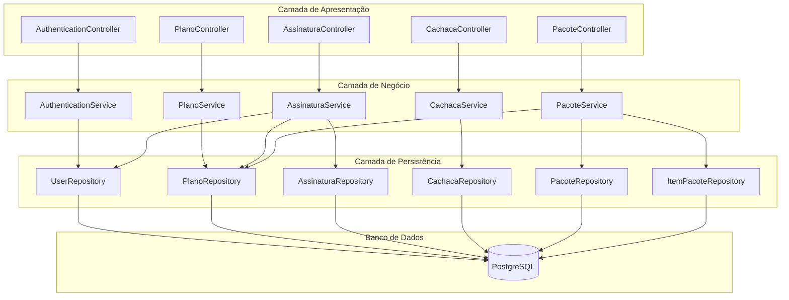

# Pingou - Sistema de Assinatura de Cachaça Artesanal


## Sobre o Projeto

O **Pingou** é uma plataforma de assinatura de cachaça artesanal brasileira que conecta apreciadores da bebida a experiências únicas de degustação. O sistema oferece diferentes planos de assinatura com entregas mensais de cachaças selecionadas de pequenos alambiques do Brasil.

### Funcionalidades Principais

- 🔐 **Autenticação e Autorização** com JWT
- 👤 **Gestão de Usuários** com roles (USER/ADMIN)  
- 📋 **Planos de Assinatura** com diferentes características
- 🎯 **Sistema de Assinaturas** 1:1 usuário-assinatura
- 🍺 **Catálogo de Cachaças** com herança JPA
- 📦 **Pacotes Mensais** organizados por plano
- 🔗 **Items de Pacote** ligando produtos aos pacotes
- 🛡️ **Tratamento de Exceções** específico por módulo
- 📚 **Documentação Swagger** integrada

## Diagrama UML do Sistema

### Relacionamentos Entre Entidades

```mermaid
erDiagram
    USER {
        bigint id PK
        varchar email UK
        varchar nome
        varchar sobrenome
        varchar password
        varchar role
    }
    
    ASSINATURA {
        bigint id PK
        bigint user_id FK,UK
        bigint plano_id FK
        varchar status
        date data_inicio
        date data_expiracao
    }
    
    PLANO {
        bigint id PK
        varchar nome UK
        text descricao
        decimal preco
        integer max_produtos_por_mes
        varchar frequencia_entrega
        boolean ativo
    }
    
    PACOTE {
        bigint id PK
        bigint plano_id FK
        varchar nome
        text descricao
        date data_entrega
        integer mes
        integer ano
        boolean ativo
    }
    
    ITEM_PACOTE {
        bigint id PK
        bigint pacote_id FK
        bigint produto_id FK
        integer quantidade
        text observacoes
    }
    
    PRODUTO {
        bigint id PK
        varchar nome
        text descricao
        decimal preco
        varchar url_imagem
        boolean ativo
    }
    
    CACHACA {
        bigint id PK,FK
        varchar regiao
        decimal teor_alcoolico
        integer volume
        varchar tipo_cachaca
        varchar tipo_envelhecimento
        integer tempo_envelhecimento_meses
        integer ano_producao
    }

    %% Relacionamentos
    USER ||--o| ASSINATURA : "possui uma"
    ASSINATURA }o--|| PLANO : "vinculada a"
    PLANO ||--o{ PACOTE : "contém vários"
    PACOTE ||--o{ ITEM_PACOTE : "possui itens"
    ITEM_PACOTE }o--|| PRODUTO : "referencia"
    PRODUTO ||--o| CACHACA : "especialização"
```



### Arquitetura em Camadas



### Diagrama Detalhado de Classes

Para visualizar o diagrama completo de classes com todos os relacionamentos, métodos e atributos, consulte o arquivo [`uml-diagram.md`](./uml-diagram.md).

## Tecnologias Utilizadas

- **Backend Framework**: Spring Boot 3.5.5
- **Linguagem**: Java 21
- **Banco de Dados**: PostgreSQL 15
- **ORM**: Hibernate/JPA
- **Segurança**: Spring Security + JWT
- **Documentação**: SpringDoc OpenAPI (Swagger)
- **Build Tool**: Maven
- **Containerização**: Docker Compose

## Estrutura do Projeto

```
src/main/java/com/pds/pingou/
├── AI/                          # Módulo de IA (Gemini)
├── admin/                       # Gestão administrativa
│   ├── controller/
│   └── service/
├── assinatura/                  # Sistema de assinaturas
│   ├── exception/
│   └── handler/
├── enums/                       # Enumerações do sistema
├── pacote/                      # Pacotes mensais
│   ├── exception/
│   └── handler/
├── planos/                      # Planos de assinatura
│   ├── exception/
│   └── handler/
├── produto/                     # Hierarquia de produtos
│   └── cachaca/                 # Especialização cachaça
│       ├── exception/
│       └── handler/
└── security/                    # Segurança e autenticação
    ├── auth/
    │   └── dto/
    ├── config/
    ├── exception/
    ├── handler/
    └── user/
```

## Principais Entidades e Relacionamentos

### 1. **User ↔ Assinatura** (1:1)
- Cada usuário pode ter **apenas uma assinatura ativa**
- Relacionamento bidirecional com cascade

### 2. **Assinatura ↔ Plano** (N:1)
- Uma assinatura está vinculada a um plano específico
- Múltiplas assinaturas podem usar o mesmo plano

### 3. **Plano ↔ Pacote** (1:N)
- Cada plano possui **múltiplos pacotes mensais**
- Pacotes organizam entregas por mês/ano

### 4. **Pacote ↔ ItemPacote** (1:N)
- Cada pacote contém **vários itens** (produtos)
- Relacionamento com quantidade e observações

### 5. **ItemPacote ↔ Produto** (N:1)
- Entidade de ligação entre pacotes e produtos
- Permite mesmo produto em múltiplos pacotes

### 6. **Produto ↔ Cachaça** (Herança)
- **Produto**: classe abstrata base
- **Cachaça**: especialização com atributos específicos
- Estratégia de herança: `JOINED`

## APIs Principais

### Autenticação
- `POST /api/v1/auth/register` - Cadastro de usuário
- `POST /api/v1/auth/login` - Login
- `POST /api/v1/auth/refresh-token` - Renovar token

### Planos
- `GET /api/v1/planos` - Listar planos
- `POST /api/v1/planos` - Criar plano
- `PUT /api/v1/planos/{id}` - Atualizar plano

### Assinaturas
- `POST /api/v1/assinaturas/ativar` - Ativar assinatura
- `POST /api/v1/assinaturas/desativar/{userId}` - Desativar assinatura

### Cachaças
- `GET /api/v1/cachaças` - Listar cachaças ativas
- `GET /api/v1/cachaças/regiao/{regiao}` - Buscar por região
- `GET /api/v1/cachaças/tipo/{tipo}` - Buscar por tipo

### Pacotes
- `GET /api/v1/pacotes/plano/{planoId}` - Pacotes de um plano
- `POST /api/v1/pacotes/{id}/itens` - Adicionar item ao pacote

## Configuração e Execução

### Pré-requisitos
- Java 21+
- Docker e Docker Compose
- Maven 3.8+

### Executando com Docker

1. **Clone o repositório**:
```bash
git clone <repository-url>
cd pingou-PDS
```

2. **Suba o banco PostgreSQL**:
```bash
docker-compose up -d postgres
```

3. **Execute a aplicação**:
```bash
./mvnw spring-boot:run
```

### Configurações do Banco
- **Host**: localhost:5432
- **Database**: pingou  
- **User**: admin
- **Password**: admin

### Acessando a Documentação
- **Swagger UI**: http://localhost:8080/swagger-ui.html
- **OpenAPI JSON**: http://localhost:8080/v3/api-docs

## Carga de dados (dump) para testes

- Dump completo (schema + dados): src/main/resources/data/pingou-dump.sql
- Aviso: o script faz DROP TABLE antes de recriar; use apenas em ambiente de desenvolvimento.

Como importar automaticamente
- Windows (PowerShell): executar scripts/import-db.ps1
- macOS/Linux (Bash): executar scripts/import-db.sh

Alternativa manual (Docker)
- Suba o Postgres: docker-compose up -d postgres
- Copie o dump para o container: docker cp src/main/resources/data/pingou-dump.sql postgres:/tmp/pingou-dump.sql
- Importe no banco: docker exec -i postgres psql -U admin -d pingou -v ON_ERROR_STOP=1 -f /tmp/pingou-dump.sql

Após importar
- Rode a aplicação e use as rotas de autenticação para obter tokens.
- Para testar rotas ADMIN, altere a role de um usuário para ADMIN diretamente no banco se necessário.

## Padrões Arquiteturais Utilizados

### 1. **Repository Pattern**
- Abstração da camada de dados
- Interfaces JPA específicas por entidade

### 2. **DTO Pattern**
- **Request DTOs**: dados de entrada
- **Response DTOs**: dados de saída
- **Mappers**: conversão entre entidades e DTOs

### 3. **Exception Handler Pattern**
- **Global handlers**: tratamento centralizado
- **Exceções específicas**: por módulo de negócio
- **HTTP status codes**: apropriados para cada erro

### 4. **Strategy Pattern (Herança JPA)**
- **JOINED strategy**: tabelas separadas para especialização
- **Produto** como classe base abstrata
- **Cachaça** como especialização concreta

### 5. **Builder Pattern (Lombok)**
- Geração automática de getters/setters
- Construtores customizados
- Redução de boilerplate code

## Funcionalidades de Destaque

### 🔒 Segurança Robusta
- **JWT authentication** com refresh tokens
- **Role-based authorization** (USER/ADMIN)
- **Password encoding** com BCrypt

### 📦 Sistema de Pacotes Flexível  
- **Pacotes mensais** organizados por plano
- **Items configuráveis** com quantidade e observações
- **Relacionamentos bidirecionais** para navegação eficiente

### 🎯 Assinaturas Controladas
- **Uma assinatura por usuário** (constraint de negócio)
- **Status de assinatura** com enum específico
- **Ativação/desativação** com controle de datas

### 🍺 Catálogo Especializado
- **Herança JPA** para hierarquia de produtos
- **Enums específicos** para características da cachaça
- **Busca avançada** por região e tipo

### 📊 Queries Otimizadas
- **Lazy loading** para performance
- **Custom queries** com @Query
- **Índices** em campos críticos (email único)

## Equipe de Desenvolvimento

- **Backend**: Spring Boot + PostgreSQL
- **Documentação**: Javadoc + Swagger
- **Arquitetura**: Clean Architecture + DDD

---

*Projeto desenvolvido como parte da disciplina de Padrões de Desenvolvimento de Software (PDS)*