# Subscription Framework - UML Diagrams

## Diagrama de Classes - Entidades do Core

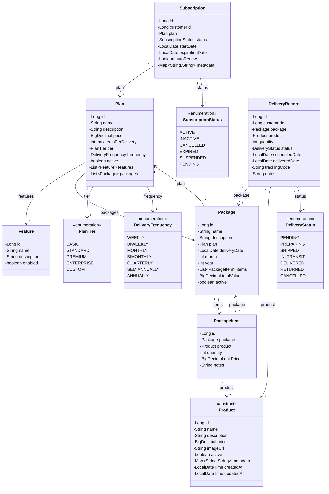

---

## Diagrama de Classes - Herança de Product

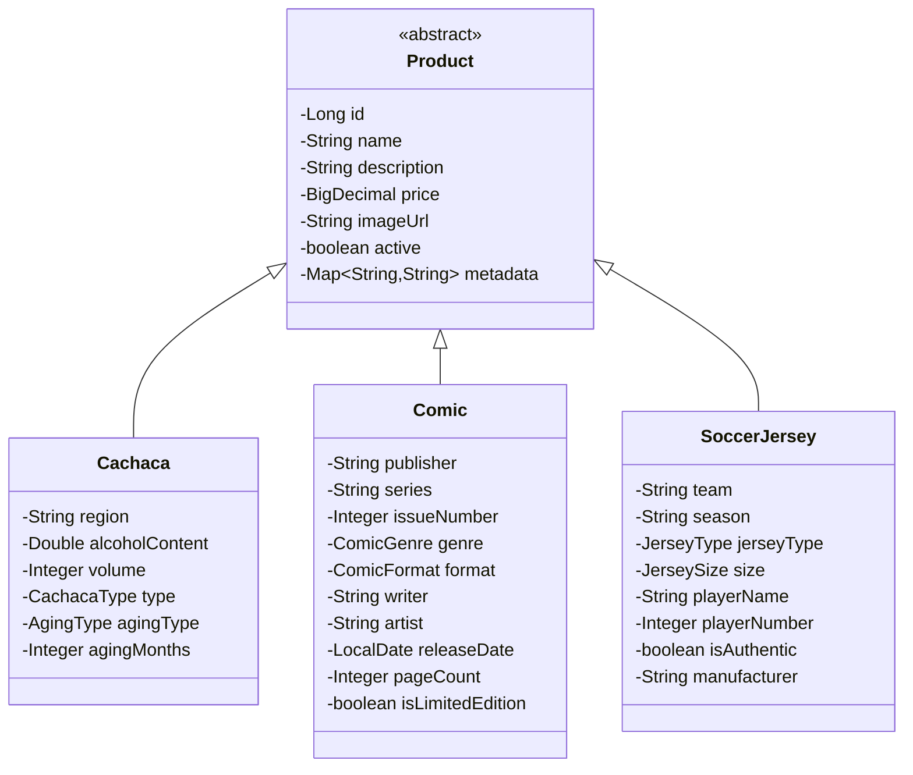

---

## Diagrama de Classes - Herança de Plan

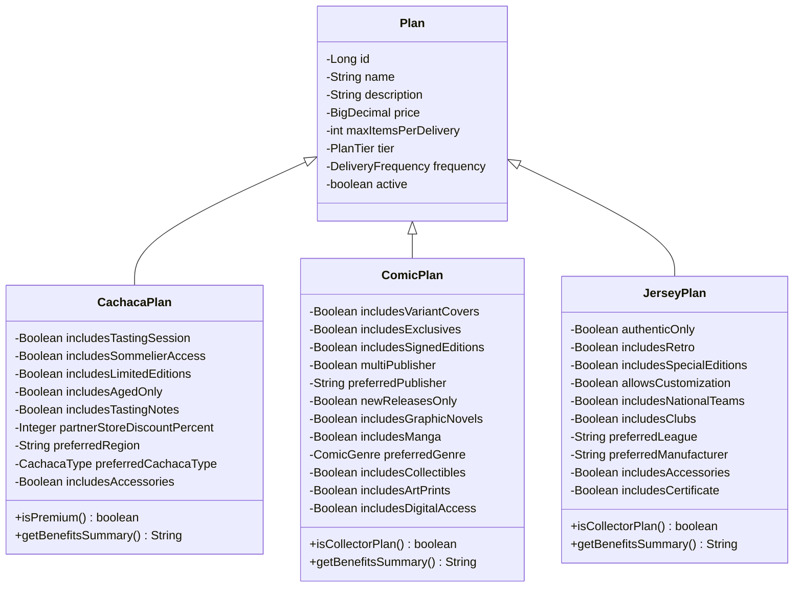

---

## Diagrama de Classes - Herança de Subscription

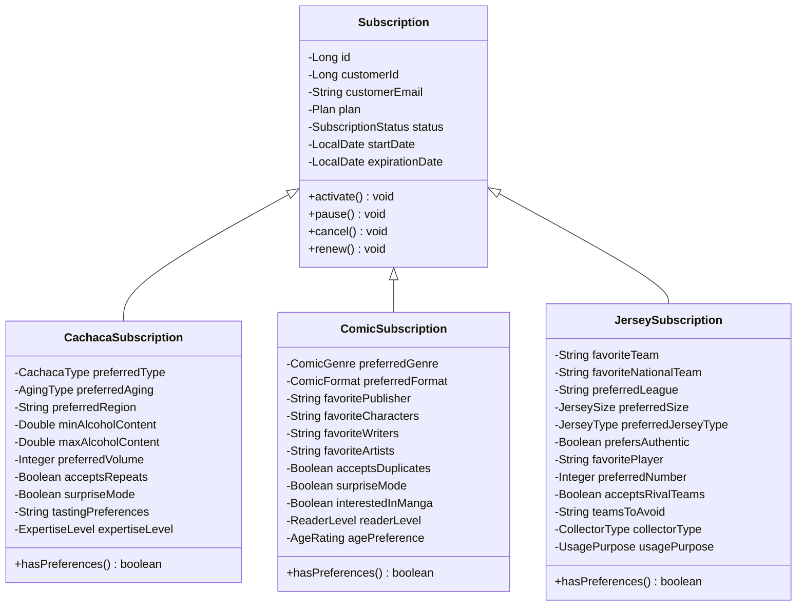

---

## Diagrama de Classes - Herança de Package

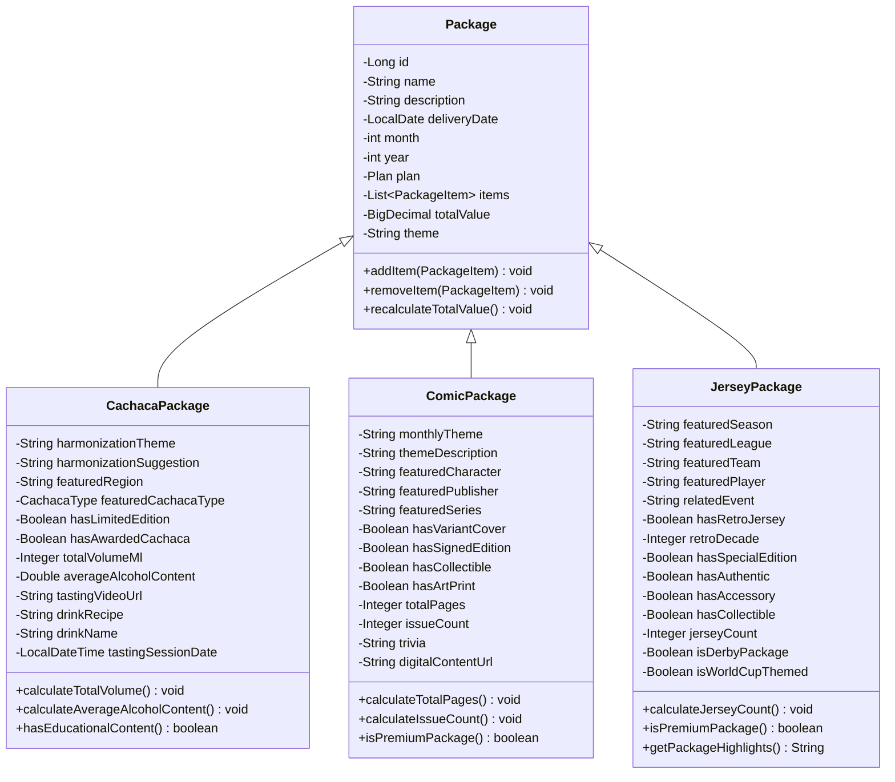

---

## Diagrama de Classes - Camada de Serviços

```mermaid
classDiagram
    direction TB
    
    %% ===== CONTRACTS (Interfaces) =====
    class ProductService~T~ {
        <<interface>>
        +save(T product) T
        +findById(Long id) Optional~T~
        +findAll() List~T~
        +findActive() List~T~
        +deleteById(Long id) void
        +findByCategory(String category) List~T~
        +findInPriceRange(BigDecimal min, BigDecimal max) List~T~
    }
    
    class PlanService {
        <<interface>>
        +save(Plan plan) Plan
        +findById(Long id) Optional~Plan~
        +findAll() List~Plan~
        +findActive() List~Plan~
        +findByTier(PlanTier tier) List~Plan~
        +addFeature(Long planId, Feature feature) Plan
        +removeFeature(Long planId, Long featureId) Plan
    }
    
    class SubscriptionService {
        <<interface>>
        +create(Long customerId, Long planId) Subscription
        +cancel(Long subscriptionId) Subscription
        +pause(Long subscriptionId) Subscription
        +resume(Long subscriptionId) Subscription
        +upgrade(Long subscriptionId, Long newPlanId) Subscription
        +downgrade(Long subscriptionId, Long newPlanId) Subscription
        +renew(Long subscriptionId) Subscription
        +findByCustomer(Long customerId) List~Subscription~
        +findByStatus(SubscriptionStatus status) List~Subscription~
    }
    
    class BillingService {
        <<interface>>
        +processPayment(Long customerId, BigDecimal amount, String desc) boolean
        +refund(String transactionId, BigDecimal amount) boolean
        +getPaymentHistory(Long customerId) List~Map~
        +generateInvoice(Long subscriptionId) String
    }
    
    class DeliveryService {
        <<interface>>
        +scheduleDelivery(Long customerId, Long packageId, LocalDate date) DeliveryRecord
        +cancelDelivery(Long deliveryId) boolean
        +trackDelivery(Long deliveryId) DeliveryRecord
        +updateDeliveryStatus(Long deliveryId, DeliveryStatus status) DeliveryRecord
    }
    
    class NotificationService {
        <<interface>>
        +sendSubscriptionCreated(Long customerId, Subscription sub) void
        +sendDeliveryScheduled(Long customerId, DeliveryRecord delivery) void
        +sendPaymentProcessed(Long customerId, BigDecimal amount) void
        +sendSubscriptionExpiring(Long customerId, Subscription sub) void
    }
    
    %% ===== ABSTRACT SERVICES =====
    class AbstractProductService~T~ {
        <<abstract>>
        #ProductRepository~T~ repository
        +save(T product) T
        +findById(Long id) Optional~T~
        +findAll() List~T~
        #validateProduct(T product) void
        #beforeSave(T product) void
        #afterSave(T product) void
        #beforeDelete(T product) void
    }
    
    class AbstractPlanService {
        <<abstract>>
        +save(Plan plan) Plan
        +findByTier(PlanTier tier) List~Plan~
        #validatePlan(Plan plan) void
        #beforeSave(Plan plan) void
        #afterSave(Plan plan) void
    }
    
    class AbstractSubscriptionService {
        <<abstract>>
        +create(Long customerId, Long planId) Subscription
        +cancel(Long subscriptionId) Subscription
        #validateSubscription(Subscription sub) void
        #onSubscriptionCreated(Subscription sub) void
        #onSubscriptionCancelled(Subscription sub) void
    }
    
    %% ===== CONCRETE SERVICES =====
    class CachacaService {
        +findByRegion(String region) List~Cachaca~
        +findByType(CachacaType type) List~Cachaca~
        +findAged() List~Cachaca~
    }
    
    class ComicService {
        +findByPublisher(String publisher) List~Comic~
        +findByGenre(ComicGenre genre) List~Comic~
        +findLimitedEditions() List~Comic~
    }
    
    class SoccerJerseyService {
        +findByTeam(String team) List~SoccerJersey~
        +findBySeason(String season) List~SoccerJersey~
        +findAuthenticOnly() List~SoccerJersey~
    }
    
    %% ===== INFRASTRUCTURE STUBS =====
    class StubBillingService {
        +processPayment() boolean
        +refund() boolean
    }
    
    class StubDeliveryService {
        +scheduleDelivery() DeliveryRecord
        +trackDelivery() DeliveryRecord
    }
    
    class StubNotificationService {
        +sendSubscriptionCreated() void
        +sendDeliveryScheduled() void
    }
    
    %% ===== RELATIONSHIPS =====
    ProductService~T~ <|.. AbstractProductService~T~
    PlanService <|.. AbstractPlanService
    SubscriptionService <|.. AbstractSubscriptionService
    
    AbstractProductService~T~ <|-- CachacaService
    AbstractProductService~T~ <|-- ComicService
    AbstractProductService~T~ <|-- SoccerJerseyService
    
    BillingService <|.. StubBillingService
    DeliveryService <|.. StubDeliveryService
    NotificationService <|.. StubNotificationService
```

---

## Diagrama de Pacotes

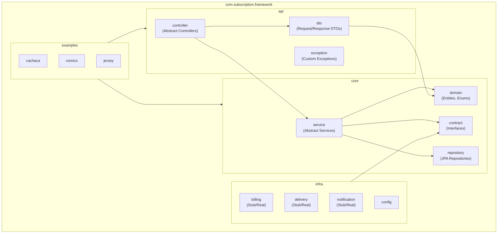

---

## Diagrama de Sequência - Criar Assinatura

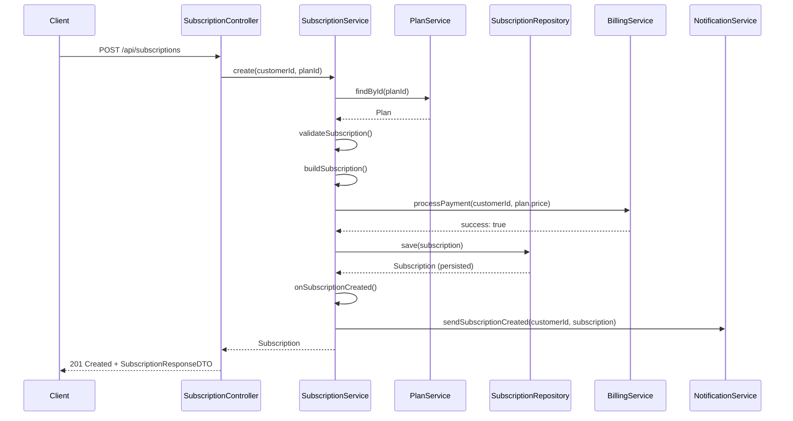

---

## Diagrama de Sequência - Adicionar Item ao Pacote

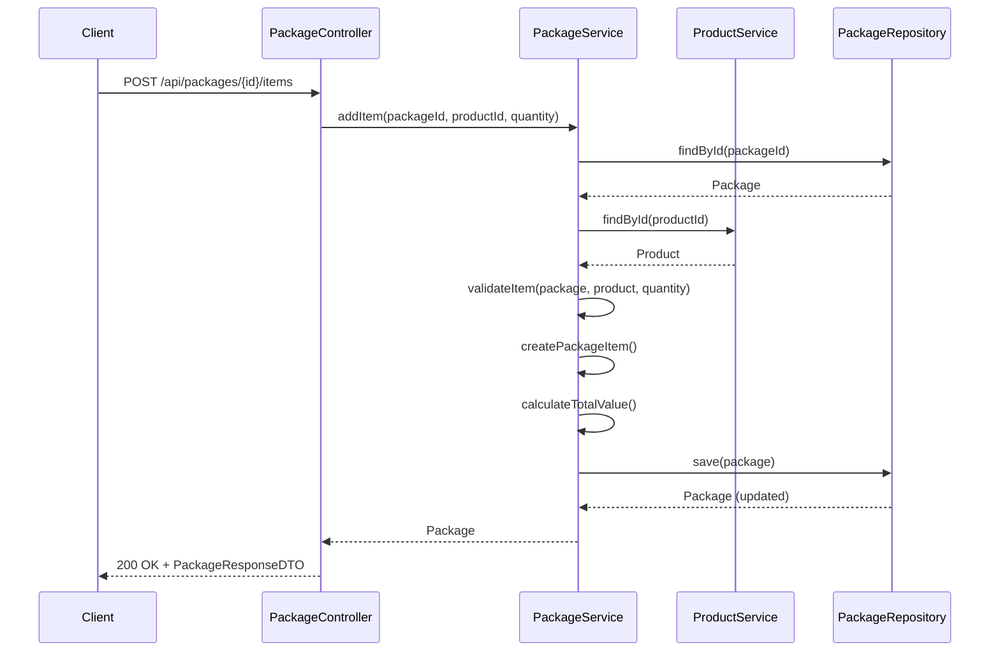

---

## Diagrama de Estados - Subscription

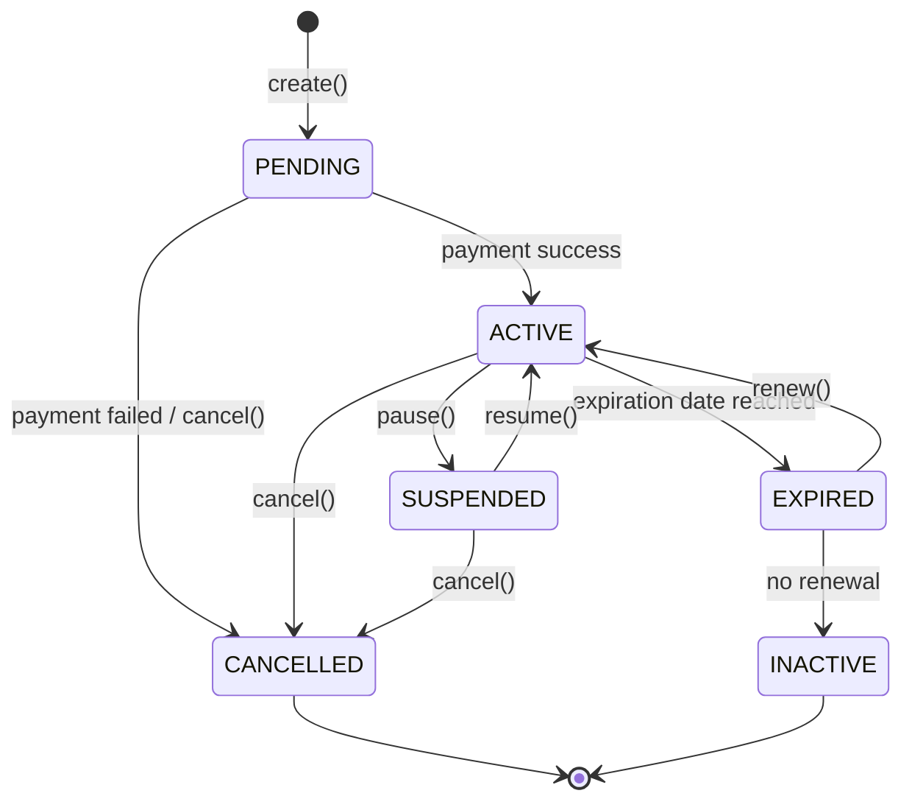

---

## Diagrama de Estados - Delivery

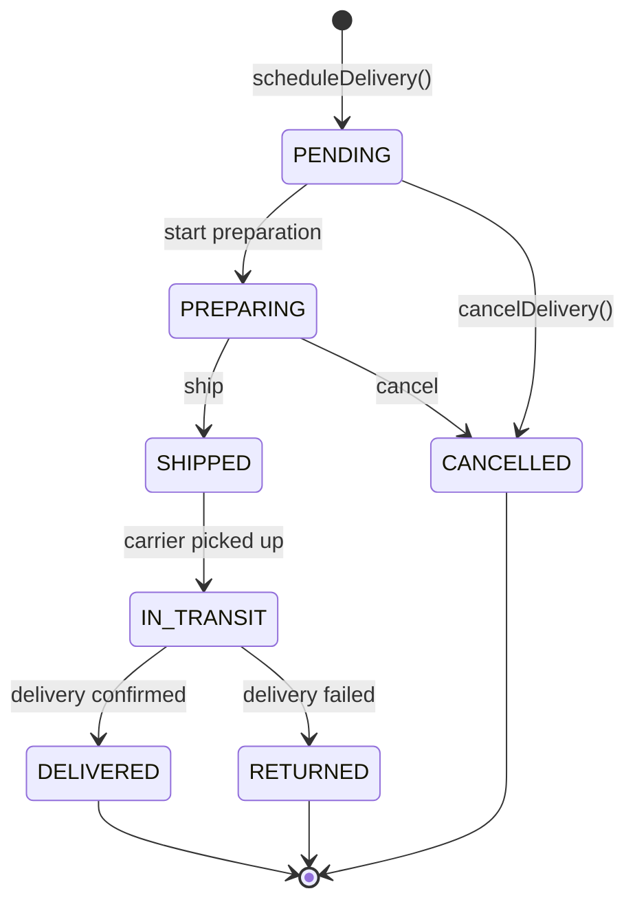

---

## Modelo ER (Entity-Relationship)

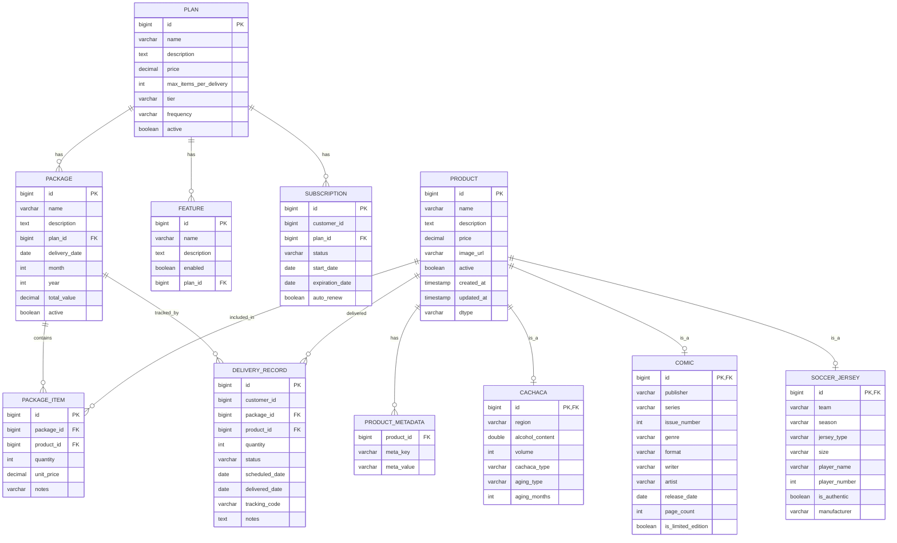
