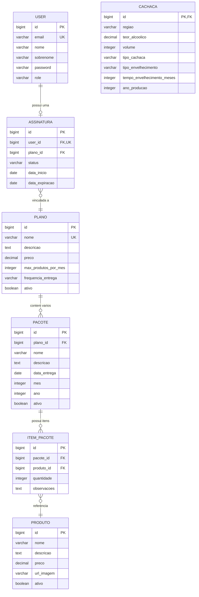
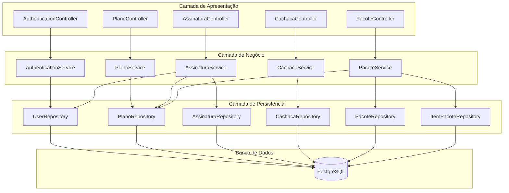

# Diagrama UML - Sistema Pingou (Assinatura de Cachaça Artesanal)

## Diagrama de Classes Completo

```mermaid
classDiagram
    %% Entidades de Segurança e Usuários
    class User {
        -Long id
        -String email
        -String nome
        -String sobrenome
        -String password
        -UserRole role
        -Assinatura assinatura
        +getAuthorities()
        +getUsername()
        +isAccountNonExpired()
        +isAccountNonLocked()
        +isCredentialsNonExpired()
        +isEnabled()
        +getAssinaturaAtiva(Plano plano)
    }

    class UserRole {
        <<enumeration>>
        ADMIN
        USER
        +getRole()
    }

    %% Entidades de Negócio - Planos e Assinaturas
    class Plano {
        -Long id
        -String nome
        -String descricao
        -BigDecimal preco
        -Integer maxProdutosPorMes
        -String frequenciaEntrega
        -Boolean ativo
        -List~Pacote~ pacotes
        +Plano(nome, descricao, preco, maxProdutosPorMes)
        +adicionarPacote(Pacote pacote)
        +removerPacote(Pacote pacote)
    }

    class Assinatura {
        -Long id
        -User user
        -Plano plano
        -StatusAssinatura status
        -LocalDate dataInicio
        -LocalDate dataExpiracao
        +Assinatura(user, plano, status, dataInicio, dataExpiracao)
    }

    class StatusAssinatura {
        <<enumeration>>
        ATIVA
        INATIVA
        CANCELADA
        EXPIRADA
        +isAtiva()
        +podeRenovar()
        +podeUsar()
    }

    %% Entidades de Produto
    class Produto {
        <<abstract>>
        -Long id
        -String nome
        -String descricao
        -BigDecimal preco
        -String urlImagem
        -Boolean ativo
        +Produto()
        +Produto(nome, descricao, preco)
    }

    class Cachaca {
        -String regiao
        -BigDecimal teorAlcoolico
        -Integer volume
        -TipoCachaca tipoCachaca
        -TipoEnvelhecimento tipoEnvelhecimento
        -Integer tempoEnvelhecimentoMeses
        -Integer anoProducao
        +Cachaca()
        +Cachaca(nome, descricao, preco, regiao, teorAlcoolico, volume, tipoCachaca)
    }

    class TipoCachaca {
        <<enumeration>>
        BRANCA
        OURO
        ENVELHECIDA
        PREMIUM
        EXTRA_PREMIUM
        +getDescricao()
    }

    class TipoEnvelhecimento {
        <<enumeration>>
        SEM_ENVELHECIMENTO
        ENVELHECIDA
        EXTRA_ENVELHECIDA
        PREMIUM
        +getDescricao()
    }

    %% Entidades de Pacote
    class Pacote {
        -Long id
        -String nome
        -String descricao
        -LocalDate dataEntrega
        -Integer mes
        -Integer ano
        -Plano plano
        -List~ItemPacote~ itens
        -Boolean ativo
        +Pacote()
        +Pacote(nome, descricao, dataEntrega, mes, ano, plano)
        +adicionarItem(ItemPacote item)
        +removerItem(ItemPacote item)
    }

    class ItemPacote {
        -Long id
        -Pacote pacote
        -Produto produto
        -Integer quantidade
        -String observacoes
        +ItemPacote()
        +ItemPacote(pacote, produto, quantidade)
    }

    %% Services
    class AuthenticationService {
        +register(RegisterRequestDTO) AuthenticationResponseDto
        +login(LoginRequestDTO) AuthenticationResponseDto
        +refreshToken(HttpServletRequest, HttpServletResponse)
    }

    class PlanoService {
        +listarTodos() List~PlanoResponseDTO~
        +buscarPorId(Long) PlanoResponseDTO
        +criar(PlanoRequestDTO) PlanoResponseDTO
        +atualizar(Long, PlanoRequestDTO) PlanoResponseDTO
        +deletar(Long)
    }

    class AssinaturaService {
        +ativarAssinatura(Long, Long) Assinatura
        +desativarAssinatura(Long) Assinatura
        +listarAssinaturas() List~Assinatura~
        +buscarPorId(Long) Assinatura
        +criarAssinatura(AssinaturaRequestDTO) Assinatura
        +editarAssinatura(Long, AssinaturaRequestDTO) Assinatura
        +deletarAssinatura(Long)
    }

    class CachacaService {
        +listarTodas() List~CachacaResponseDTO~
        +listarAtivas() List~CachacaResponseDTO~
        +buscarPorId(Long) CachacaResponseDTO
        +criar(CachacaRequestDTO) CachacaResponseDTO
        +atualizar(Long, CachacaRequestDTO) CachacaResponseDTO
        +deletar(Long)
        +buscarPorRegiao(String) List~CachacaResponseDTO~
        +buscarPorTipo(TipoCachaca) List~CachacaResponseDTO~
    }

    class PacoteService {
        +listarTodos() List~PacoteResponseDTO~
        +buscarPorId(Long) PacoteResponseDTO
        +buscarPorPlano(Long) List~PacoteResponseDTO~
        +buscarPorMesEAno(Integer, Integer) List~PacoteResponseDTO~
        +criar(PacoteRequestDTO) PacoteResponseDTO
        +atualizar(Long, PacoteRequestDTO) PacoteResponseDTO
        +deletar(Long)
        +adicionarItem(Long, ItemPacoteRequestDTO) PacoteResponseDTO
        +removerItem(Long, Long) PacoteResponseDTO
    }

    %% Repositories
    class UserRepository {
        <<interface>>
        +findByEmail(String) Optional~User~
    }

    class PlanoRepository {
        <<interface>>
        +existsByNome(String) boolean
    }

    class AssinaturaRepository {
        <<interface>>
        +findByUser(User) Optional~Assinatura~
        +existsByUser(User) boolean
    }

    class ProdutoRepository {
        <<interface>>
        +findByAtivoTrue() List~Produto~
        +findByNomeContainingAndAtivoTrue(String) List~Produto~
    }

    class CachacaRepository {
        <<interface>>
        +findByRegiaoAndAtivoTrue(String) List~Cachaca~
        +findByTipoCachacaAndAtivoTrue(TipoCachaca) List~Cachaca~
    }

    class PacoteRepository {
        <<interface>>
        +findByPlanoAndAtivoTrue(Plano) List~Pacote~
        +findByMesAndAnoAndAtivoTrue(Integer, Integer) List~Pacote~
        +findByDataEntregaBetweenAndAtivoTrue(LocalDate, LocalDate) List~Pacote~
        +findByPlanoIdAndMesAndAno(Long, Integer, Integer) List~Pacote~
    }

    class ItemPacoteRepository {
        <<interface>>
        +findByPacote(Pacote) List~ItemPacote~
        +findByProdutoId(Long) List~ItemPacote~
    }

    %% Relacionamentos JPA
    User ||--|| UserRole : possui
    User ||--o| Assinatura : possui
    
    Assinatura }o--|| User : pertence_a
    Assinatura }o--|| Plano : vinculada_a
    Assinatura ||--|| StatusAssinatura : possui

    Plano ||--o{ Pacote : contem
    Plano ||--o{ Assinatura : oferece

    Pacote }o--|| Plano : pertence_a
    Pacote ||--o{ ItemPacote : contem

    ItemPacote }o--|| Pacote : pertence_a
    ItemPacote }o--|| Produto : contem

    Produto <|-- Cachaca : heranca
    Cachaca ||--|| TipoCachaca : classificada_como
    Cachaca ||--|| TipoEnvelhecimento : possui

    %% Relacionamentos de Dependência - Services para Repositories
    AuthenticationService --> UserRepository : usa
    PlanoService --> PlanoRepository : usa
    AssinaturaService --> AssinaturaRepository : usa
    AssinaturaService --> UserRepository : usa
    AssinaturaService --> PlanoRepository : usa
    CachacaService --> CachacaRepository : usa
    PacoteService --> PacoteRepository : usa
    PacoteService --> PlanoRepository : usa
    PacoteService --> ProdutoRepository : usa
    PacoteService --> ItemPacoteRepository : usa

    %% Relacionamentos de Dependência - Repositories para Entities
    UserRepository --> User : gerencia
    PlanoRepository --> Plano : gerencia
    AssinaturaRepository --> Assinatura : gerencia
    ProdutoRepository --> Produto : gerencia
    CachacaRepository --> Cachaca : gerencia
    PacoteRepository --> Pacote : gerencia
    ItemPacoteRepository --> ItemPacote : gerencia
```

## Diagrama de Relacionamentos Simplificado



## Arquitetura em Camadas

